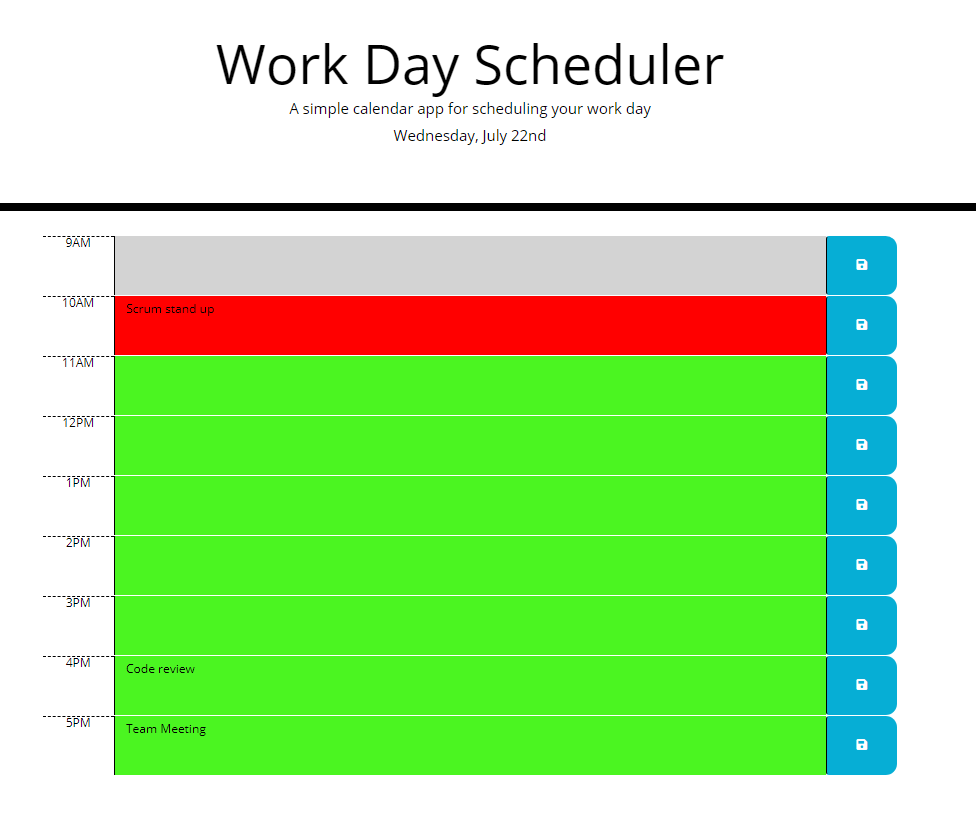
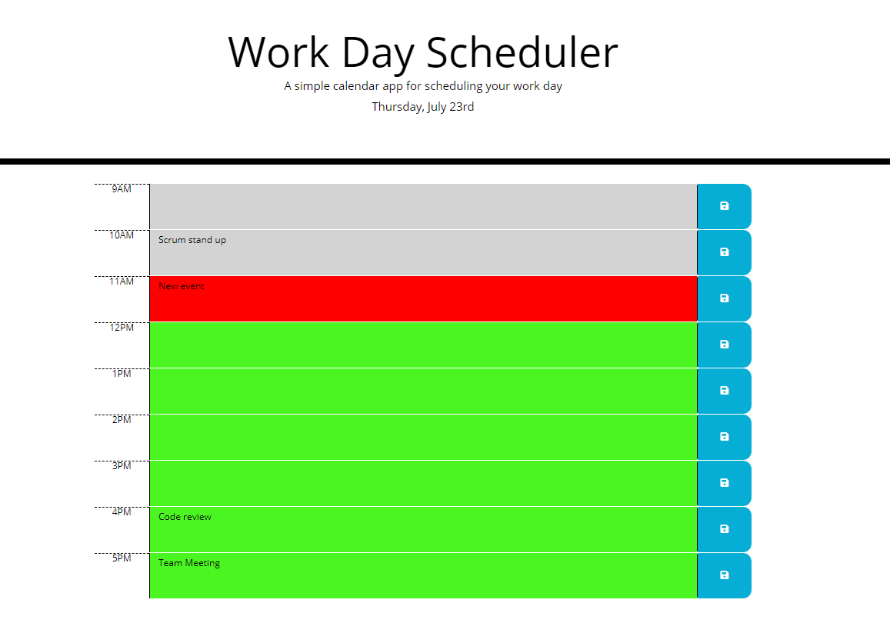

# 05-homework
Day Planner

This is a day planner to create a schedule that shows each timeblock of the working day.

When the planner is opened, the current day is displayed at the top of the calendar.
When you scroll down, you get timeblocks for standard business hours
which is color coded to indicate whether it is in the past, present, or future
You can change, add or remove an event from the timeblock and click the save button
so event gets stored in that timeblock.
The page can be refreshed and old events still exist from localStorage.
This planner gets refreshed every 15 seconds to keep it updated.

